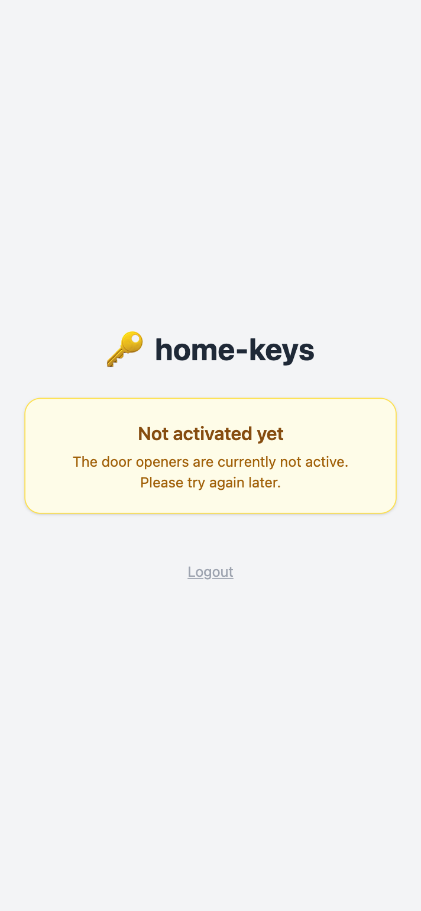

# Explanation

## Why stateless sessions?

home-keys has no database. Sessions are encoded entirely in a signed cookie — the server stores nothing between requests. This keeps the deployment minimal (a single binary in a scratch container) and makes horizontal scaling trivial.

The signing key is derived from `HMAC(SESSION_SECRET, current_PIN)`. This means that changing the PIN in Home Assistant immediately invalidates every active session: the next request by any logged-in user will fail HMAC validation and redirect them to the login screen. No explicit session store or revocation list is needed.

---

## How entity discovery works

At startup, home-keys calls the Home Assistant `/api/states` endpoint, which returns the state of every entity in the system. The application filters this list to entities with the `lock` domain prefix and calls `lock.unlock` to open them. Entities listed in `IGNORED_ENTITIES` are removed from this set.

The button label on the dashboard comes from the entity's `friendly_name` attribute in HA. If no `friendly_name` is set, the entity ID is used as a fallback. This means renaming an entity in HA and restarting home-keys is all that is needed to update the label.

The set of doors is fixed at startup. Changes in HA (new entities, renames) take effect after a restart.

---

## The unlock allowance gate

The `ENTITY_UNLOCK_ALLOWANCE` `input_boolean` acts as a real-time gate. Its state is checked on every dashboard render and every door-open request — not cached. Turning it off in HA takes effect for the next user interaction with no restart needed.

When the allowance is off, logged-in users see the "not yet enabled" notice:

Any direct `POST /open` request is rejected with `403 Forbidden` regardless of how it is sent.

---

## Rate limiting design

The in-memory rate limiter uses a per-IP sliding window (5 attempts / 15 minutes). It is intentionally simple:

- No persistence — a restart resets all buckets. This is acceptable because the limiter's purpose is to slow down online guessing, not to enforce a hard policy over restarts.
- Memory is bounded — expired buckets are swept every 5 minutes by a background goroutine.
- The limit applies to login POST attempts only, not to authenticated requests.

For deployments behind a reverse proxy, the limiter reads the `X-Forwarded-For` header to get the real client IP.
