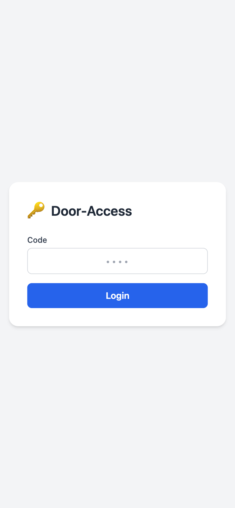
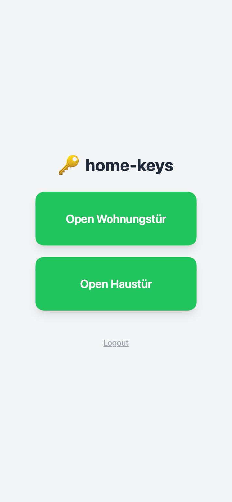

# Tutorial: Running home-keys for the first time

This tutorial walks you through cloning the project, connecting it to your Home Assistant instance, and opening your first door. You will need Docker and a running Home Assistant with at least one `lock` entity.

---

## Step 1 — Clone the repository

```bash
git clone https://github.com/jeboehm/home-keys.git
cd home-keys
```

## Step 2 — Create your configuration

Copy the example env file and fill in your values:

```bash
cp .env.example .env
```

Open `.env` in an editor. The minimum required changes:

| Variable                  | What to set                                                            |
| ------------------------- | ---------------------------------------------------------------------- |
| `SESSION_SECRET`          | Run `openssl rand -hex 32` and paste the output                        |
| `HA_URL`                  | Address of your Home Assistant, e.g. `http://homeassistant.local:8123` |
| `HA_TOKEN`                | Long-lived access token from HA → Profile → Security                   |
| `ENTITY_UNLOCK_ALLOWANCE` | Entity ID of the `input_boolean` that enables unlocking                |
| `ENTITY_DOOR_CODE`        | Entity ID of the `input_text` that holds the PIN                       |

## Step 3 — Start the service

```bash
docker compose up --build
```

The startup log will confirm how many door entities were discovered:

```
2024/01/01 12:00:00 Discovered 2 door(s)
2024/01/01 12:00:00 Startup health check passed
2024/01/01 12:00:00 Starting home-keys on :8080
```

## Step 4 — Log in

Open `http://localhost:8080` in your browser. You will see the login screen:



Enter the PIN you configured in the `ENTITY_DOOR_CODE` helper in Home Assistant, then tap **Einloggen**.

> If the `input_text` entity is empty in HA, login is automatic with no PIN required.

## Step 5 — Open a door

After logging in you will see a button for each discovered lock entity. Enable the `ENTITY_UNLOCK_ALLOWANCE` boolean in Home Assistant first, then tap the button.



The door name on each button comes directly from the entity's `friendly_name` in Home Assistant — no configuration needed.

---

**Next steps:** see [How-to guides](how-to.md) for rotating the PIN, ignoring entities, and deploying updates.
